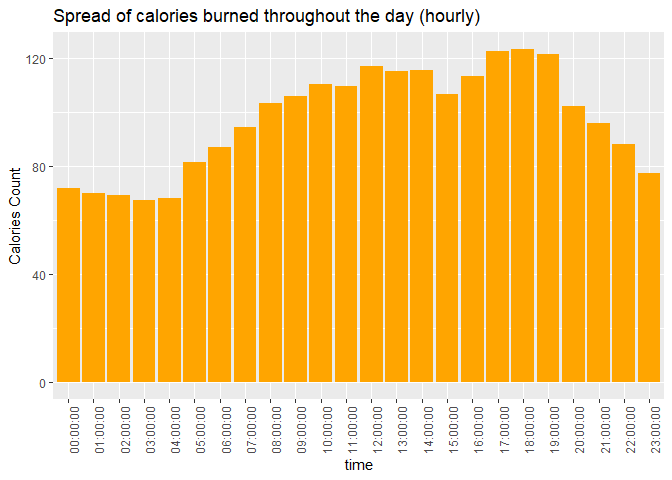

How Can a Wellness Technology Company Play It Smart?
================

------------------------------------------------------------------------

## Before we start…

------------------------------------------------------------------------

Welcome to my second notebook (with R) in my portfolio. This is another
notebook for the capstone projects as part of the Coursera: Google Data
Analytics Certification Course. As stated in my previous notebook, I aim
to update these notebooks as I slowly gain more knowledge with using R
and apply new skills / methods to perform further analysis on this case
study.

------------------------------------------------------------------------

## Introduction

------------------------------------------------------------------------

**Urška Sršen**, *Bellabeat’s cofounder and Chief Creative Officer*, and
**Sando Mur**, *Mathematician and Bellabeat’s cofounder*, founded
Bellabeat, a high-tech company that manufactures health-focused smart
products. Sršen used her background as an artist to develop beautifully
designed technology that informs and inspires women around the world.
Collecting data on activity, sleep, stress, and reproductive health has
allowed Bellabeat to empower women with knowledge about their own health
and habits. Since it was founded in 2013, Bellabeat has grown rapidly
and quickly positioned itself as a tech-driven wellness company for
women.

By 2016, Bellabeat had opened offices around the world and launched
multiple products. Bellabeat products became available through a growing
number of online retailers in addition to their own e-commerce channel
on their website. The company has invested in traditional advertising
media, such as radio, out-of-home billboards, print, and television, but
focuses on digital marketing extensively. Bellabeat invests year-round
in Google Search, maintaining active Facebook and Instagram pages, and
consistently engages consumers on Twitter. Additionally, Bellabeat runs
video ads on Youtube and display ads on the Google Display Network to
support campaigns around key marketing dates.

Sršen knows that an analysis of Bellabeat’s available consumer data
would reveal more opportunities for growth. She has asked the marketing
analytics team to focus on a Bellabeat product and analyze smart device
usage data in order to gain insight into how people are already using
their smart devices. Then, using this information, she would like
high-level recommendations for how these trends can inform Bellabeat
marketing strategy.

Sršen asks us to *analyze smart device usage data in order to gain
insight into how consumers use non-Bellabeat smart devices*. She then
wants us to select one Bellabeat product to apply these insights to in
your presentation. These questions will guide your analysis:

1.  What are some trends in smart device usage?
2.  How could these trends apply to Bellabeat customers?
3.  How could these trends help influence Bellabeat marketing strategy?

------------------------------------------------------------------------

## Preparing and Processing data

------------------------------------------------------------------------

We will be using the *FitBit Fitness Tracker Data* data set *(CC0:
Public Domain, dataset made available through Mobius)*. This Kaggle data
set contains personal fitness tracker from thirty FitBit users. Thirty
eligible FitBit users consented to the submission of personal tracker
data, including minute-level output for physical activity, heart rate,
and sleep monitoring. It includes information about daily activity,
steps, and heart rate that can be used to explore users’ habits.

``` r
library(tidyverse)
library(lubridate)
```

------------------------------------------------------------------------

For the purpose of this case study, we’ll be using csv files containing
information about: - daily activity measured through total steps,
activeness levels and calories burned on a daily / hourly basis - sleep
patterns measured through sleep duration and time spent in bed - weight
patterns with information on BMI, weight in KG/pounds and fat %

------------------------------------------------------------------------

``` r
# loading data...
activities <- read_csv("dailyActivity_merged.csv")
calories <- read_csv("dailyCalories_merged.csv")
intensities <- read_csv("dailyIntensities_merged.csv")
sleep <- read_csv("sleepDay_merged.csv")
weight <- read_csv("weightLogInfo_merged.csv") 

hourly_intensities <- read_csv("hourlyIntensities_merged.csv")
hourly_calories <- read_csv("hourlyCalories_merged.csv")
```

``` r
# initial inspection of data
activities %>%
  select(TotalSteps, TotalDistance, Calories) %>%
  summary()
```

    ##    TotalSteps    TotalDistance       Calories   
    ##  Min.   :    0   Min.   : 0.000   Min.   :   0  
    ##  1st Qu.: 3790   1st Qu.: 2.620   1st Qu.:1828  
    ##  Median : 7406   Median : 5.245   Median :2134  
    ##  Mean   : 7638   Mean   : 5.490   Mean   :2304  
    ##  3rd Qu.:10727   3rd Qu.: 7.713   3rd Qu.:2793  
    ##  Max.   :36019   Max.   :28.030   Max.   :4900

``` r
intensities %>%
  select(-Id, -ActivityDay) %>%
  summary()
```

    ##  SedentaryMinutes LightlyActiveMinutes FairlyActiveMinutes VeryActiveMinutes
    ##  Min.   :   0.0   Min.   :  0.0        Min.   :  0.00      Min.   :  0.00   
    ##  1st Qu.: 729.8   1st Qu.:127.0        1st Qu.:  0.00      1st Qu.:  0.00   
    ##  Median :1057.5   Median :199.0        Median :  6.00      Median :  4.00   
    ##  Mean   : 991.2   Mean   :192.8        Mean   : 13.56      Mean   : 21.16   
    ##  3rd Qu.:1229.5   3rd Qu.:264.0        3rd Qu.: 19.00      3rd Qu.: 32.00   
    ##  Max.   :1440.0   Max.   :518.0        Max.   :143.00      Max.   :210.00   
    ##  SedentaryActiveDistance LightActiveDistance ModeratelyActiveDistance
    ##  Min.   :0.000000        Min.   : 0.000      Min.   :0.0000          
    ##  1st Qu.:0.000000        1st Qu.: 1.945      1st Qu.:0.0000          
    ##  Median :0.000000        Median : 3.365      Median :0.2400          
    ##  Mean   :0.001606        Mean   : 3.341      Mean   :0.5675          
    ##  3rd Qu.:0.000000        3rd Qu.: 4.782      3rd Qu.:0.8000          
    ##  Max.   :0.110000        Max.   :10.710      Max.   :6.4800          
    ##  VeryActiveDistance
    ##  Min.   : 0.000    
    ##  1st Qu.: 0.000    
    ##  Median : 0.210    
    ##  Mean   : 1.503    
    ##  3rd Qu.: 2.053    
    ##  Max.   :21.920

``` r
sleep %>%
  select(-Id, -SleepDay) %>%
  summary()
```

    ##  TotalSleepRecords TotalMinutesAsleep TotalTimeInBed 
    ##  Min.   :1.000     Min.   : 58.0      Min.   : 61.0  
    ##  1st Qu.:1.000     1st Qu.:361.0      1st Qu.:403.0  
    ##  Median :1.000     Median :433.0      Median :463.0  
    ##  Mean   :1.119     Mean   :419.5      Mean   :458.6  
    ##  3rd Qu.:1.000     3rd Qu.:490.0      3rd Qu.:526.0  
    ##  Max.   :3.000     Max.   :796.0      Max.   :961.0

``` r
weight %>%
  select(WeightKg, BMI) %>%
  summary()
```

    ##     WeightKg           BMI       
    ##  Min.   : 52.60   Min.   :21.45  
    ##  1st Qu.: 61.40   1st Qu.:23.96  
    ##  Median : 62.50   Median :24.39  
    ##  Mean   : 72.04   Mean   :25.19  
    ##  3rd Qu.: 85.05   3rd Qu.:25.56  
    ##  Max.   :133.50   Max.   :47.54

``` r
str(activities)
```

    ## spec_tbl_df [940 × 15] (S3: spec_tbl_df/tbl_df/tbl/data.frame)
    ##  $ Id                      : num [1:940] 1.5e+09 1.5e+09 1.5e+09 1.5e+09 1.5e+09 ...
    ##  $ ActivityDate            : chr [1:940] "4/12/2016" "4/13/2016" "4/14/2016" "4/15/2016" ...
    ##  $ TotalSteps              : num [1:940] 13162 10735 10460 9762 12669 ...
    ##  $ TotalDistance           : num [1:940] 8.5 6.97 6.74 6.28 8.16 ...
    ##  $ TrackerDistance         : num [1:940] 8.5 6.97 6.74 6.28 8.16 ...
    ##  $ LoggedActivitiesDistance: num [1:940] 0 0 0 0 0 0 0 0 0 0 ...
    ##  $ VeryActiveDistance      : num [1:940] 1.88 1.57 2.44 2.14 2.71 ...
    ##  $ ModeratelyActiveDistance: num [1:940] 0.55 0.69 0.4 1.26 0.41 ...
    ##  $ LightActiveDistance     : num [1:940] 6.06 4.71 3.91 2.83 5.04 ...
    ##  $ SedentaryActiveDistance : num [1:940] 0 0 0 0 0 0 0 0 0 0 ...
    ##  $ VeryActiveMinutes       : num [1:940] 25 21 30 29 36 38 42 50 28 19 ...
    ##  $ FairlyActiveMinutes     : num [1:940] 13 19 11 34 10 20 16 31 12 8 ...
    ##  $ LightlyActiveMinutes    : num [1:940] 328 217 181 209 221 164 233 264 205 211 ...
    ##  $ SedentaryMinutes        : num [1:940] 728 776 1218 726 773 ...
    ##  $ Calories                : num [1:940] 1985 1797 1776 1745 1863 ...
    ##  - attr(*, "spec")=
    ##   .. cols(
    ##   ..   Id = col_double(),
    ##   ..   ActivityDate = col_character(),
    ##   ..   TotalSteps = col_double(),
    ##   ..   TotalDistance = col_double(),
    ##   ..   TrackerDistance = col_double(),
    ##   ..   LoggedActivitiesDistance = col_double(),
    ##   ..   VeryActiveDistance = col_double(),
    ##   ..   ModeratelyActiveDistance = col_double(),
    ##   ..   LightActiveDistance = col_double(),
    ##   ..   SedentaryActiveDistance = col_double(),
    ##   ..   VeryActiveMinutes = col_double(),
    ##   ..   FairlyActiveMinutes = col_double(),
    ##   ..   LightlyActiveMinutes = col_double(),
    ##   ..   SedentaryMinutes = col_double(),
    ##   ..   Calories = col_double()
    ##   .. )
    ##  - attr(*, "problems")=<externalptr>

``` r
str(calories)
```

    ## spec_tbl_df [940 × 3] (S3: spec_tbl_df/tbl_df/tbl/data.frame)
    ##  $ Id         : num [1:940] 1.5e+09 1.5e+09 1.5e+09 1.5e+09 1.5e+09 ...
    ##  $ ActivityDay: chr [1:940] "4/12/2016" "4/13/2016" "4/14/2016" "4/15/2016" ...
    ##  $ Calories   : num [1:940] 1985 1797 1776 1745 1863 ...
    ##  - attr(*, "spec")=
    ##   .. cols(
    ##   ..   Id = col_double(),
    ##   ..   ActivityDay = col_character(),
    ##   ..   Calories = col_double()
    ##   .. )
    ##  - attr(*, "problems")=<externalptr>

``` r
str(intensities)
```

    ## spec_tbl_df [940 × 10] (S3: spec_tbl_df/tbl_df/tbl/data.frame)
    ##  $ Id                      : num [1:940] 1.5e+09 1.5e+09 1.5e+09 1.5e+09 1.5e+09 ...
    ##  $ ActivityDay             : chr [1:940] "4/12/2016" "4/13/2016" "4/14/2016" "4/15/2016" ...
    ##  $ SedentaryMinutes        : num [1:940] 728 776 1218 726 773 ...
    ##  $ LightlyActiveMinutes    : num [1:940] 328 217 181 209 221 164 233 264 205 211 ...
    ##  $ FairlyActiveMinutes     : num [1:940] 13 19 11 34 10 20 16 31 12 8 ...
    ##  $ VeryActiveMinutes       : num [1:940] 25 21 30 29 36 38 42 50 28 19 ...
    ##  $ SedentaryActiveDistance : num [1:940] 0 0 0 0 0 0 0 0 0 0 ...
    ##  $ LightActiveDistance     : num [1:940] 6.06 4.71 3.91 2.83 5.04 ...
    ##  $ ModeratelyActiveDistance: num [1:940] 0.55 0.69 0.4 1.26 0.41 ...
    ##  $ VeryActiveDistance      : num [1:940] 1.88 1.57 2.44 2.14 2.71 ...
    ##  - attr(*, "spec")=
    ##   .. cols(
    ##   ..   Id = col_double(),
    ##   ..   ActivityDay = col_character(),
    ##   ..   SedentaryMinutes = col_double(),
    ##   ..   LightlyActiveMinutes = col_double(),
    ##   ..   FairlyActiveMinutes = col_double(),
    ##   ..   VeryActiveMinutes = col_double(),
    ##   ..   SedentaryActiveDistance = col_double(),
    ##   ..   LightActiveDistance = col_double(),
    ##   ..   ModeratelyActiveDistance = col_double(),
    ##   ..   VeryActiveDistance = col_double()
    ##   .. )
    ##  - attr(*, "problems")=<externalptr>

``` r
str(sleep)
```

    ## spec_tbl_df [413 × 5] (S3: spec_tbl_df/tbl_df/tbl/data.frame)
    ##  $ Id                : num [1:413] 1.5e+09 1.5e+09 1.5e+09 1.5e+09 1.5e+09 ...
    ##  $ SleepDay          : chr [1:413] "4/12/2016 12:00:00 AM" "4/13/2016 12:00:00 AM" "4/15/2016 12:00:00 AM" "4/16/2016 12:00:00 AM" ...
    ##  $ TotalSleepRecords : num [1:413] 1 2 1 2 1 1 1 1 1 1 ...
    ##  $ TotalMinutesAsleep: num [1:413] 327 384 412 340 700 304 360 325 361 430 ...
    ##  $ TotalTimeInBed    : num [1:413] 346 407 442 367 712 320 377 364 384 449 ...
    ##  - attr(*, "spec")=
    ##   .. cols(
    ##   ..   Id = col_double(),
    ##   ..   SleepDay = col_character(),
    ##   ..   TotalSleepRecords = col_double(),
    ##   ..   TotalMinutesAsleep = col_double(),
    ##   ..   TotalTimeInBed = col_double()
    ##   .. )
    ##  - attr(*, "problems")=<externalptr>

``` r
str(weight)
```

    ## spec_tbl_df [67 × 8] (S3: spec_tbl_df/tbl_df/tbl/data.frame)
    ##  $ Id            : num [1:67] 1.50e+09 1.50e+09 1.93e+09 2.87e+09 2.87e+09 ...
    ##  $ Date          : chr [1:67] "5/2/2016 11:59:59 PM" "5/3/2016 11:59:59 PM" "4/13/2016 1:08:52 AM" "4/21/2016 11:59:59 PM" ...
    ##  $ WeightKg      : num [1:67] 52.6 52.6 133.5 56.7 57.3 ...
    ##  $ WeightPounds  : num [1:67] 116 116 294 125 126 ...
    ##  $ Fat           : num [1:67] 22 NA NA NA NA 25 NA NA NA NA ...
    ##  $ BMI           : num [1:67] 22.6 22.6 47.5 21.5 21.7 ...
    ##  $ IsManualReport: logi [1:67] TRUE TRUE FALSE TRUE TRUE TRUE ...
    ##  $ LogId         : num [1:67] 1.46e+12 1.46e+12 1.46e+12 1.46e+12 1.46e+12 ...
    ##  - attr(*, "spec")=
    ##   .. cols(
    ##   ..   Id = col_double(),
    ##   ..   Date = col_character(),
    ##   ..   WeightKg = col_double(),
    ##   ..   WeightPounds = col_double(),
    ##   ..   Fat = col_double(),
    ##   ..   BMI = col_double(),
    ##   ..   IsManualReport = col_logical(),
    ##   ..   LogId = col_double()
    ##   .. )
    ##  - attr(*, "problems")=<externalptr>

------------------------------------------------------------------------

Let’s check for any rows with null values. I noticed that there is a
substantial amount of wors with null values in the weight data frame.
After inspecting the data frame, all of the null values seem to be
coming from the *Fat* column. Let’s keep these rows as they still
contain valuable information such as the weights of the individual users
which we could use for analysis later on.

------------------------------------------------------------------------

``` r
sum(is.na(activities)) # 0
```

    ## [1] 0

``` r
sum(is.na(calories)) # 0
```

    ## [1] 0

``` r
sum(is.na(intensities)) # 0
```

    ## [1] 0

``` r
sum(is.na(sleep)) # 0
```

    ## [1] 0

``` r
sum(is.na(weight)) # 65 
```

    ## [1] 65

``` r
sum(is.na(weight$Fat)) # 65, confirmed from fat column
```

    ## [1] 65

------------------------------------------------------------------------

Now, let’s check for distinct users in the various data frames. We can
see that there are 33 users who shared their information except for the
sleep and weight data frames which have 24 users and 8 users who shared
their information respectively. Performing analysis with the weight data
frame is going to be challenging as the population size for that data
set is way too little for it to have any significance in our analysis.

------------------------------------------------------------------------

``` r
# let's find out how many users are there in each data set
n_distinct(activities$Id) # 33
```

    ## [1] 33

``` r
n_distinct(calories$Id) # 33 
```

    ## [1] 33

``` r
n_distinct(intensities$Id) # 33
```

    ## [1] 33

``` r
n_distinct(sleep$Id) # 24
```

    ## [1] 24

``` r
n_distinct(weight$Id) # 8
```

    ## [1] 8

``` r
n_distinct(hourly_intensities$Id) # 33
```

    ## [1] 33

``` r
n_distinct(hourly_calories$Id) # 33
```

    ## [1] 33

------------------------------------------------------------------------

Now, let’s format our variables in our data frames so that we can
perform proper analysis on them later on.

------------------------------------------------------------------------

``` r
# fixing date || time formats

activities$ActivityDate <- as.POSIXct(activities$ActivityDate, format="%m/%d/%Y", tz=Sys.timezone())
activities <- rename(activities, date = ActivityDate)

calories$ActivityDay <- as.POSIXct(calories$ActivityDay, format="%m/%d/%Y", tz=Sys.timezone())
calories <- rename(calories, date = ActivityDay)

intensities$ActivityDay <- as.POSIXct(intensities$ActivityDay, format="%m/%d/%Y", tz=Sys.timezone())
intensities <- rename(intensities, date = ActivityDay)

sleep$SleepDay <- as.POSIXct(sleep$SleepDay, format="%m/%d/%Y %I:%M:%S %p", tz=Sys.timezone())
sleep <- rename(sleep, date = SleepDay)

weight$Date <- as.POSIXct(weight$Date, format="%m/%d/%Y %I:%M:%S %p", tz=Sys.timezone())
weight$Date <- as.Date(x = weight$Date)
weight <-rename(weight, date = Date)
```

------------------------------------------------------------------------

Let’s create specific data frames with different sets of variables for
our analysis.

------------------------------------------------------------------------

``` r
# joining tables to conduct various analysis across variables

# activities + sleep
activities_sleep <- sleep %>%
  left_join(activities, by=c("Id", "date"))


# weight + sleep
weight_sleep <- weight %>%
  left_join(sleep, by=c("Id", "date"))


# activities + weight
activities_weight <- weight %>%
  left_join(activities, by=c("Id", "date"))


# hourly intensities + hourly calories
hourly_intens_cals <- hourly_intensities %>%
  left_join(hourly_calories, by=c("Id", "ActivityHour"))
```

``` r
# formatting date || time for this dataframe
hourly_intens_cals$ActivityHour=as.POSIXct(hourly_intens_cals$ActivityHour, format="%m/%d/%Y %I:%M:%S %p", tz=Sys.timezone())
hourly_intens_cals$time <- format(hourly_intens_cals$ActivityHour, format = "%H:%M:%S")
hourly_intens_cals$date <- format(hourly_intens_cals$ActivityHour, format = "%m/%d/%y")
```

------------------------------------------------------------------------

## Analysis

------------------------------------------------------------------------

## Total Steps vs Calories Burned

``` r
# relationship between total steps and calories intake

steps_vs_cals <- ggplot(activities, aes(x=TotalSteps, y=Calories)) +
  geom_point() +
  geom_smooth() +
  labs(title = "Total Steps vs Calories burned")

steps_vs_cals
```

<!-- --> \*\*\*

We can see that there is a positive correlation between total steps and
calories burned. This makes sense as the more steps you take, more
calories are burned as a result.

------------------------------------------------------------------------

## Spread of Average Intensity Levels in a day

``` r
# spread of AVG intensity throughout the day

avg_intensity <- hourly_intens_cals %>%
  group_by(time) %>%
  drop_na() %>%
  summarise(mean_intensity = mean(TotalIntensity))

intensity_spread <- ggplot(avg_intensity, aes(x=time, y=mean_intensity)) +
  geom_histogram(stat = "identity", fill="orange") +
  labs(title="Spread of activity levels throughout the day (hourly)", y="Intensity Count") + 
  theme(axis.text.x = element_text(angle = 90))

intensity_spread
```

<!-- --> \*\*\*

Here, we can see that as one’s day progresses, they get more active.
Activity levels seem to peak at around 5pm to 7pm. This may suggest that
the users engage themselves in some form of exercise after work, given
that work hours are typically 9am-5pm.

From this, we can implement some form of **reminder in our devices to
remind users to engage in exercise after work**.

------------------------------------------------------------------------

## Spread of Average Calories burned throughout the day

``` r
# spread of AVG calories burned throughout the day

avg_calories <- hourly_intens_cals %>%
  group_by(time) %>%
  drop_na() %>%
  summarise(mean_calories = mean(Calories))

intensity_spread <- ggplot(avg_calories, aes(x=time, y=mean_calories)) +
  geom_histogram(stat = "identity", fill="orange") +
  labs(title="Spread of calories burned throughout the day (hourly)", y="Calories Count") + 
  theme(axis.text.x = element_text(angle = 90))

intensity_spread
```

<!-- --> \*\*\*

Here, we can see that as users get on with their day, they burn more
calories by activities such as making their way to work (*maybe by doing
a quick 100m dash to catch the bus too!*). Calories burned seem to peak
at 5pm to 7pm, which supports our previous findings of users being
active in the same period as well.

------------------------------------------------------------------------

## Smart device usage

``` r
# grouping our users based on how many days they used the device in a month
daily_use <- activities %>%
  group_by(Id) %>%
  summarize(days_used=sum(n())) %>%
  mutate(usage = case_when(
    days_used >= 1 & days_used <= 10 ~ "low usage",
    days_used >= 11 & days_used <= 20 ~ "moderate usage", 
    days_used >= 21 & days_used <= 31 ~ "high usage", 
  ))

daily_use
```

<div data-pagedtable="false">

<script data-pagedtable-source type="application/json">
{"columns":[{"label":["Id"],"name":[1],"type":["dbl"],"align":["right"]},{"label":["days_used"],"name":[2],"type":["int"],"align":["right"]},{"label":["usage"],"name":[3],"type":["chr"],"align":["left"]}],"data":[{"1":"1503960366","2":"31","3":"high usage"},{"1":"1624580081","2":"31","3":"high usage"},{"1":"1644430081","2":"30","3":"high usage"},{"1":"1844505072","2":"31","3":"high usage"},{"1":"1927972279","2":"31","3":"high usage"},{"1":"2022484408","2":"31","3":"high usage"},{"1":"2026352035","2":"31","3":"high usage"},{"1":"2320127002","2":"31","3":"high usage"},{"1":"2347167796","2":"18","3":"moderate usage"},{"1":"2873212765","2":"31","3":"high usage"},{"1":"3372868164","2":"20","3":"moderate usage"},{"1":"3977333714","2":"30","3":"high usage"},{"1":"4020332650","2":"31","3":"high usage"},{"1":"4057192912","2":"4","3":"low usage"},{"1":"4319703577","2":"31","3":"high usage"},{"1":"4388161847","2":"31","3":"high usage"},{"1":"4445114986","2":"31","3":"high usage"},{"1":"4558609924","2":"31","3":"high usage"},{"1":"4702921684","2":"31","3":"high usage"},{"1":"5553957443","2":"31","3":"high usage"},{"1":"5577150313","2":"30","3":"high usage"},{"1":"6117666160","2":"28","3":"high usage"},{"1":"6290855005","2":"29","3":"high usage"},{"1":"6775888955","2":"26","3":"high usage"},{"1":"6962181067","2":"31","3":"high usage"},{"1":"7007744171","2":"26","3":"high usage"},{"1":"7086361926","2":"31","3":"high usage"},{"1":"8053475328","2":"31","3":"high usage"},{"1":"8253242879","2":"19","3":"moderate usage"},{"1":"8378563200","2":"31","3":"high usage"},{"1":"8583815059","2":"31","3":"high usage"},{"1":"8792009665","2":"29","3":"high usage"},{"1":"8877689391","2":"31","3":"high usage"}],"options":{"columns":{"min":{},"max":[10]},"rows":{"min":[10],"max":[10]},"pages":{}}}
  </script>

</div>

``` r
daily_use_percent <- daily_use %>%
  group_by(usage) %>%
  summarise(total=n()) %>%
  mutate(totals = sum(total)) %>%
  group_by(usage) %>%
  summarise(total_percent = total / totals) %>%
  mutate(labels = scales::percent(total_percent))

daily_use_percent
```

<div data-pagedtable="false">

<script data-pagedtable-source type="application/json">
{"columns":[{"label":["usage"],"name":[1],"type":["chr"],"align":["left"]},{"label":["total_percent"],"name":[2],"type":["dbl"],"align":["right"]},{"label":["labels"],"name":[3],"type":["chr"],"align":["left"]}],"data":[{"1":"high usage","2":"0.87878788","3":"87.9%"},{"1":"low usage","2":"0.03030303","3":"3.0%"},{"1":"moderate usage","2":"0.09090909","3":"9.1%"}],"options":{"columns":{"min":{},"max":[10]},"rows":{"min":[10],"max":[10]},"pages":{}}}
  </script>

</div>

``` r
usage_viz <- ggplot(daily_use_percent, aes(fill=usage, y=total_percent, x="Usage percentage")) + 
  geom_bar(position="fill", stat="identity")
usage_viz
```

<!-- --> \*\*\*

Here, we can see that 87.9% of the users used the smart device very
frequently (21 - 31 days). 9.1% of the users used the smart device less
frequently (11 - 20 days) and 3% of the users with least usage (1 - 10
days). This was done by counting the number of times each user’s record
was reflected in the activity data frame, reflecting their usage for the
month.

If we want to improve daily usage, we could send a notification through
their mobile devices to wear the smart devices before getting on with
their day.

------------------------------------------------------------------------

## Conclusion

------------------------------------------------------------------------

From these insights, we have knowledge on user habits with the smart
device. Here are ideas for the Bellabeat app:

-   Bellabeat could add reminder / notification features to remind users
    to wear the smart devices before getting on with their day

-   Bellabeat should recommend healthy habits (not just limited to
    exercising) to our users. This could be in the form of sending
    reminders to stand up and stretch in hourly intervals and sending
    healthy recipe / meal ideas to their mobile devices.

-   On the topic of reminders, our app should also be their “friend”,
    where it could send motivating quotes, especially since our users
    exercise after ending work. This could give them the motivation by
    going the extra mile after a long day at work.

------------------------------------------------------------------------

## Reflection

------------------------------------------------------------------------

Well, I won’t say that this case study is complete. I still have several
things I plan to investigate:

-   hourly smart device usage
-   relationship between activeness levels and sleep duration

Another thing is that it was a shame that there was not enough data
provided to us with regards to the weight tracking of the users. This
could open up more analysis such as:

-   relationship between sleep duration and BMI
-   weight trend for the month

As with other projects, I will come back to update this case study after
learning more things with regards to statistics and data analysis in
general!

------------------------------------------------------------------------
